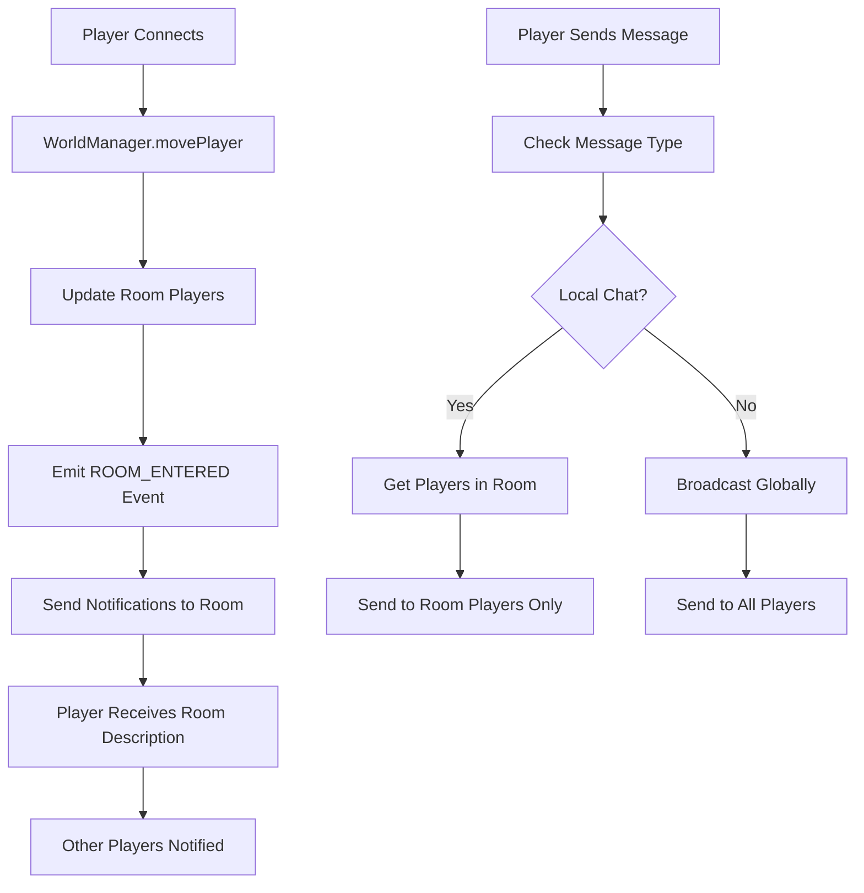

# World Module

The World module manages the game world, including rooms, areas, sectors, and NPC (Non-Player Character) integration. It provides a hierarchical world structure with dynamic NPC spawning and despawning based on player presence and game events.

## Architecture

### Core Components

- **WorldManager**: Central coordinator for world state and room management
- **NPCManager**: Handles NPC lifecycle, spawning, and despawning
- **Types**: Shared type definitions for world and NPC entities
- **Content System**: File-based world and NPC content loading

### World Structure

```
World
├── Sectors (town, forest, castle, etc.)
    ├── Rooms (individual locations)
        ├── NPCs (dynamic characters)
        ├── Items (objects and equipment)
        └── Players (connected users)
```

## Multi-User Architecture

The World module provides comprehensive multi-user capabilities that enable real-time interactions between players in a shared game world. This section covers the architecture and features that support multiple concurrent users.

### Core Multi-User Components

- **Player Tracking System**: Real-time tracking of player locations and status across all rooms
- **Room-Based Communication**: Local chat system where players in the same room can communicate
- **Movement Notifications**: Automatic notifications when players enter or leave rooms
- **Event-Driven Updates**: Real-time event system for coordinating multi-user interactions
- **Session Integration**: Seamless integration with the networking layer for session management

### Multi-User Event Flow



### Player State Management

Each player in the multi-user world maintains:

```typescript
interface PlayerState {
  sessionId: string;        // Network session identifier
  username: string;         // Player's display name
  currentRoomId: string;    // Current location
  connectionStatus: 'online' | 'offline';
  lastActivity: Date;       // For idle timeout tracking
}
```

### Communication Channels

#### Local Room Communication
Players in the same room can communicate with each other through local chat:

```typescript
// Example: Player sends local message
engine.sendMessage(sessionId, "Hello everyone in the tavern!");

// Result: Only players in the same room receive:
// [Alice] Hello everyone in the tavern!
```

#### Global Communication
System-wide announcements and global chat are also supported:

```typescript
// Global announcement
engine.broadcastMessage("Server will restart in 5 minutes", "system");

// Global chat (if implemented)
engine.broadcastMessage(`[GLOBAL] ${playerName}: System announcement!`, "broadcast");
```

### Movement and Notifications

#### Room Transition Flow
1. **Player Command**: Player types movement command (e.g., "north", "south")
2. **Validation**: WorldManager validates the exit exists
3. **State Update**: Player is moved from old room to new room
4. **Notifications**: Other players in both rooms receive notifications
5. **Description**: Moving player receives new room description

#### Notification Examples

```typescript
// When Alice enters a room with Bob and Charlie:
// Bob and Charlie see: "Alice has entered the room."
// Alice sees: "You move north." + room description

// When Alice leaves a room:
// Bob and Charlie see: "Alice has left the room."
```

### Player Tracking Implementation

The WorldManager provides efficient player tracking:

```typescript
// Get all players in a specific room
const playersInTavern = worldManager.getPlayersInRoom('tavern');

// Move player between rooms
const success = worldManager.movePlayer(playerId, 'tavern', 'market');

// Check if room has active players
const isEmpty = worldManager.getPlayersInRoom(roomId).length === 0;
```

### NPC Integration in Multi-User Context

NPCs respond dynamically to multiple players:

#### Player-Specific Interactions
- NPCs can track individual player dialogue states
- Different players can have different relationships with the same NPC
- NPC behaviors can vary based on number of players present

#### Room-Based NPC Behavior
```typescript
// NPC becomes more responsive with more players
const playerCount = worldManager.getPlayersInRoom(npc.roomId);
if (playerCount > 3) {
  npc.setBehavior('crowded');
}
```

### Content Creator Considerations

#### Designing for Multi-User

1. **Room Capacity Planning**: Consider how many players a room should comfortably hold
2. **NPC Conversation Design**: Plan for multiple concurrent conversations
3. **Event Synchronization**: Ensure world events work properly with multiple players
4. **Communication Flow**: Design clear communication patterns for group interactions

#### Example: Multi-User Tavern Scenario

```json
{
  "id": "tavern",
  "name": "The Prancing Pony Tavern",
  "description": "A cozy tavern where travelers gather...",
  "maxPlayers": 15,
  "features": {
    "localChat": true,
    "globalChat": false,
    "npcInteractions": true,
    "events": ["happy_hour", "storytelling"]
  }
}
```

### Best Practices for Multi-User Worlds

#### Performance Optimization
- Use room-based player tracking to avoid global searches
- Implement lazy loading for distant room content
- Cache frequently accessed room data

#### Player Experience
- Provide clear feedback for all player actions
- Ensure movement commands are responsive
- Handle edge cases (disconnecting players, full rooms)

#### Content Design
- Create rooms that encourage social interaction
- Design NPCs that work well in group settings
- Plan for varying group sizes and compositions

### Integration with Networking Layer

The World module integrates seamlessly with the networking layer:

```typescript
// EngineService coordinates all multi-user interactions
const engine = new EngineService();

// Player movement triggers notifications
engine.on('world.room.entered', (event) => {
  engine.handleRoomEntered(event);
});

// Player messages are routed through room system
engine.on('player.message', (event) => {
  engine.handlePlayerMessage(event);
});
```

This integration ensures that all multi-user features work together cohesively, providing a smooth experience for players in the shared world.

## NPC System Integration

### NPC Lifecycle Management

The NPC system integrates deeply with the world management through event-driven architecture, with enhanced support for multi-user environments:

#### Spawning
- NPCs spawn automatically when players enter rooms
- **Multi-user aware**: NPCs can spawn based on room population (e.g., spawn guards when 5+ players enter)
- Configurable spawn conditions (time, player level, flags, room capacity, etc.)
- Template-based creation for consistent NPC types
- Room-based tracking for efficient management

#### Multi-User NPC Behaviors
```typescript
// Example: NPC behavior changes based on room population
const playerCount = worldManager.getPlayersInRoom(roomId);
if (playerCount >= 5) {
  npcManager.spawnNPC('guard', roomId);
  npc.setBehavior('alert');
} else if (playerCount === 0) {
  npcManager.despawnNPC(npc.id, 30000); // Despawn after 30s
}
```

#### Despawning
- NPCs despawn when rooms become empty (configurable delay)
- **Multi-user optimization**: Prevents NPC spam in active rooms
- Configurable despawn delays and conditions
- Automatic cleanup of inactive NPCs
- Event emission for system integration and notifications

#### Multi-User Event Integration
```typescript
// NPCs react to player movement events
eventSystem.on('world.room.entered', (event) => {
  const roomId = event.data.toRoomId;
  const playerCount = worldManager.getPlayersInRoom(roomId);

  // Spawn crowd NPCs in busy areas
  if (playerCount >= 10 && !hasCrowdNPCs(roomId)) {
    npcManager.spawnNPCFromTemplate('crowd_member', roomId, 'town', {
      count: Math.min(playerCount - 9, 5) // Max 5 crowd NPCs
    });
  }
});
```

### NPC Templates

Pre-built templates for common character types:

```typescript
// Create a merchant NPC
const merchant = npcManager.createNPCFromTemplate('merchant', 'market_square', 'town', {
  name: 'Gretta the Grocer',
  inventory: ['bread', 'cheese', 'apples'],
  prices: { bread: 5, cheese: 8, apples: 3 }
});
```

#### Available Templates
- **Merchants & Vendors**: Shopkeepers with inventory management
- **Guards & Soldiers**: Military NPCs with patrol behaviors
- **Commoners**: Everyday NPCs with daily routines
- **Animals**: Wildlife with varying domestication levels
- **Special Characters**: Kings, jesters, and unique NPCs

### Content File Structure

```
engine/modules/world/content/
├── world.json                 # World configuration
├── sectors/                   # Sector definitions
│   ├── town.json
│   ├── forest.json
│   └── castle.json
├── npcs/                      # Individual NPC definitions
│   ├── blacksmith.json
│   ├── guard.json
│   └── merchant.json
└── dialogue/                  # NPC dialogue trees
    ├── blacksmith.yaml
    ├── guard.yaml
    ├── npc-mappings.json      # NPC-to-dialogue connections
    └── ...
```

### NPC Definition Format

```json
{
  "id": "blacksmith",
  "name": "a sturdy blacksmith",
  "description": "A strong blacksmith with muscular arms and a soot-stained apron.",
  "dialogueProvider": "canned-branching",
  "behaviors": ["gruff", "merchant", "craftsman"],
  "stats": {
    "level": 6,
    "health": 110,
    "strength": 16
  },
  "spawnData": {
    "spawnRoomId": "town:blacksmith",
    "spawnConditions": [{"type": "player_enter", "value": true}],
    "despawnConditions": [{"type": "no_players", "delay": 60000}]
  },
  "multiUserBehavior": {
    "maxConcurrentConversations": 3,
    "groupResponseEnabled": true,
    "crowdReaction": "overwhelmed"
  }
}
```

### Multi-User NPC Configuration

#### Crowd-Aware NPCs
```json
{
  "id": "town_crier",
  "name": "a town crier",
  "description": "A loud herald announcing news to the townsfolk.",
  "multiUserBehavior": {
    "playerCountThresholds": {
      "quiet": { "min": 0, "max": 2 },
      "normal": { "min": 3, "max": 8 },
      "crowded": { "min": 9, "max": 15 },
      "overwhelmed": { "min": 16 }
    },
    "responses": {
      "quiet": "The town crier looks around expectantly...",
      "normal": "*The town crier bellows* Hear ye, hear ye!",
      "crowded": "*The town crier shouts over the din* IMPORTANT NEWS!",
      "overwhelmed": "*The town crier sighs and waits for the crowd to thin*"
    }
  }
}
```

#### Group Interaction NPCs
```json
{
  "id": "merchant",
  "name": "a traveling merchant",
  "description": "A shrewd merchant with wares from distant lands.",
  "multiUserBehavior": {
    "groupDiscountEnabled": true,
    "maxGroupSize": 5,
    "groupPricing": {
      "2": { "discount": 0.05 },
      "3": { "discount": 0.10 },
      "4": { "discount": 0.15 },
      "5": { "discount": 0.20 }
    },
    "concurrentTrades": 3
  }
}
```

## Dialogue Integration

### Dialogue Providers

- **Canned Branching**: YAML/JSON-based dialogue trees with conditional logic
- **Variable System**: Dynamic content based on player state and world conditions
- **State Persistence**: Conversation state maintained across sessions

### Dialogue Tree Format

```yaml
id: blacksmith
startNodeId: greeting
variables:
  greeted: false
  commissioned: false

nodes:
  greeting:
    npcMessage: "Eh? What do you want?"
    choices:
      - id: "1"
        text: "I need some weapons repaired."
        nextNodeId: repair_service
```

### NPC-to-Dialogue Mapping

```json
{
  "blacksmith": "blacksmith",
  "gate_guard": "guard",
  "king": "king"
}
```

## Usage

### Basic Setup

```typescript
import { WorldManager } from './world-manager';
import { NPCManager } from './npc-manager';
import { EventSystem } from '../core/event';

// Create managers
const eventSystem = new EventSystem();
const worldManager = new WorldManager(eventSystem);
const npcManager = new NPCManager(eventSystem, logger);

// Initialize world
await worldManager.loadWorld('./content/world.json');

// Load NPCs
await npcManager.loadNPCsFromDirectory('./content/npcs');

// Start NPC spawning/despawning
npcManager.initialize();
```

### Multi-User Setup with EngineService

```typescript
import { EngineService } from '../core/engine.service';

const engine = new EngineService();

// Configure for multi-user world
engine.updateConfig({
  enableWorld: true,
  enableNetworking: true,
  enablePersistence: true,
  maxPlayersPerRoom: 20,
  worldPath: './engine/modules/world/content'
});

// Start the multi-user server
await engine.start();

// Access world and player management
const worldManager = engine.getWorldManager();
const playerManager = engine.getPlayerManager();
```

### Multi-User Communication Examples

#### Local Room Chat
```typescript
// Players in the same room can communicate
// When Alice types: "say Hello everyone!"
// Bob and Charlie (in same room) see: "Alice says: Hello everyone!"

// Implementation in command handler
engine.registerNetworkCommand({
  command: 'say',
  aliases: ['\'', '"'],
  description: 'Speak to players in the same room',
  handler: async (sessionId, args) => {
    const message = args.join(' ');
    if (!message) return 'Say what?';

    // Emit player message event (will be handled by handlePlayerMessage)
    await engine.emitEvent({
      type: 'player.message',
      source: sessionId,
      data: { message, type: 'local' },
      timestamp: new Date()
    });

    return ''; // Message sent, no response needed
  }
});
```

#### Global Announcements
```typescript
// Server-wide announcements
engine.broadcastMessage('Server will restart in 5 minutes!', 'system');

// Global chat (if implemented)
engine.registerNetworkCommand({
  command: 'global',
  aliases: ['g'],
  description: 'Send global message to all players',
  handler: async (sessionId, args) => {
    const message = args.join(' ');
    if (!message) return 'Global what?';

    const player = engine.getPlayerManager()?.getPlayerBySessionId(sessionId);
    if (!player) return 'Player not found.';

    const formattedMessage = `[GLOBAL] ${player.username}: ${message}`;
    engine.broadcastMessage(formattedMessage, 'broadcast', sessionId);

    return 'Global message sent.';
  }
});
```

### Player Movement with Notifications

```typescript
// Enhanced movement command with multi-user notifications
engine.registerNetworkCommand({
  command: 'move',
  aliases: ['north', 'south', 'east', 'west', 'up', 'down'],
  description: 'Move to another room',
  handler: async (sessionId, args) => {
    const direction = args[0] || this.command; // Use alias as direction
    const player = engine.getPlayerManager()?.getPlayerBySessionId(sessionId);

    if (!player) return 'Player not found.';

    // Find exit from current room
    const exit = engine.findExit(player.currentRoomId, direction);
    if (!exit) {
      return `You cannot go ${direction} from here.`;
    }

    // Move player (triggers ROOM_LEFT and ROOM_ENTERED events)
    const success = engine.movePlayer(sessionId, player.currentRoomId, exit.toRoomId);
    if (!success) {
      return 'Failed to move to that location.';
    }

    // Update player's room
    player.currentRoomId = exit.toRoomId;

    // Return room description to moving player
    return engine.getRoomDescription(exit.toRoomId);
  }
});
```

### Room-Based NPC Management

```typescript
// Get NPCs in a specific room
const roomNPCs = npcManager.getNPCsInRoom('town_square');

// Spawn NPC in a room
const blacksmith = npcManager.spawnNPC('blacksmith', 'town_square');

// Despawn NPC with delay
npcManager.despawnNPC('blacksmith', 30000); // 30 second delay
```

### Template-Based Creation

```typescript
// Create custom merchant
const customMerchant = npcManager.createNPCFromTemplate(
  'merchant',
  'market_square',
  'town',
  {
    name: 'Special Merchant',
    inventory: ['rare_item', 'magic_scroll'],
    prices: { rare_item: 100, magic_scroll: 50 }
  }
);
```

## Configuration

### World Configuration

```json
{
  "id": "eldoria",
  "name": "Kingdom of Eldoria",
  "sectors": [
    {
      "id": "town",
      "name": "Eldoria Town",
      "rooms": ["market", "blacksmith", "tavern"]
    }
  ]
}
```

### Spawn Conditions

```json
{
  "spawnConditions": [
    {"type": "player_enter", "value": true},
    {"type": "time", "value": "day"},
    {"type": "flag", "target": "quest_active"}
  ],
  "despawnConditions": [
    {"type": "no_players", "delay": 60000},
    {"type": "time", "value": "night"}
  ]
}
```

## Content Creator Guide

This section provides comprehensive examples and best practices for content creators designing multi-user experiences.

### Designing Multi-User Rooms

#### Room Capacity Planning
```json
{
  "id": "grand_tavern",
  "name": "The Grand Tavern",
  "description": "A bustling tavern where adventurers gather...",
  "maxPlayers": 25,
  "features": {
    "localChat": true,
    "globalChat": false,
    "npcInteractions": true,
    "events": ["happy_hour", "brawls", "storytelling"]
  },
  "multiUserConfig": {
    "crowdBehavior": {
      "thresholds": {
        "quiet": { "min": 0, "max": 5 },
        "busy": { "min": 6, "max": 15 },
        "crowded": { "min": 16, "max": 20 },
        "overcrowded": { "min": 21 }
      },
      "descriptions": {
        "quiet": "The tavern is quiet with just a few patrons.",
        "busy": "The tavern hums with conversation from many patrons.",
        "crowded": "The tavern is packed with adventurers.",
        "overcrowded": "The tavern is overflowing with people!"
      }
    },
    "communicationRange": "room",
    "notificationLevel": "detailed"
  }
}
```

#### Social Hub Design
```json
{
  "id": "town_square",
  "name": "Eldoria Town Square",
  "description": "The heart of Eldoria where townsfolk and travelers gather...",
  "maxPlayers": 50,
  "exits": {
    "north": "market_street",
    "south": "castle_road",
    "east": "merchant_district",
    "west": "residential_area"
  },
  "features": {
    "localChat": true,
    "publicEvents": true,
    "bulletinBoard": true,
    "performanceSpace": true
  },
  "socialFeatures": {
    "gatheringPoints": ["fountain", "statue", "market_stalls"],
    "eventCapacity": 30,
    "performanceCooldown": 1800000
  }
}
```

### Multi-User NPC Design Patterns

#### Crowd-Responsive NPCs
```json
{
  "id": "bartender",
  "name": "Gruff the Bartender",
  "description": "A no-nonsense bartender with a towel over his shoulder.",
  "multiUserBehavior": {
    "playerCountReactions": {
      "quiet": {
        "greeting": "What can I get ya?",
        "serviceSpeed": "normal"
      },
      "busy": {
        "greeting": "Make it quick, lots of thirsty folks here!",
        "serviceSpeed": "fast"
      },
      "crowded": {
        "greeting": "*shouting over the din* WHAT'LL IT BE?!",
        "serviceSpeed": "rush"
      }
    },
    "groupOrdering": {
      "enabled": true,
      "maxGroupSize": 8,
      "bulkDiscount": true
    }
  },
  "dialogueConfig": {
    "maxConcurrentConversations": 5,
    "conversationTimeout": 300000
  }
}
```

#### Event-Driven NPCs
```json
{
  "id": "town_herald",
  "name": "The Town Herald",
  "description": "An official messenger with important announcements.",
  "eventTriggers": {
    "playerGathering": {
      "threshold": 10,
      "cooldown": 1800000,
      "announcements": [
        "Hear ye! A dragon has been sighted near the mountains!",
        "The king's tournament begins next week!",
        "New merchants have arrived at the bazaar!"
      ]
    },
    "questCompletion": {
      "listenFor": ["dragon_slain", "tournament_won"],
      "celebration": "Fantastic news, citizens! {event} has occurred!"
    }
  },
  "multiUserFeatures": {
    "broadcastRange": "sector",
    "repeatForNewArrivals": true,
    "importanceLevel": "high"
  }
}
```

### Communication Flow Design

#### Room-Based Chat Scenarios
```typescript
// Example: Tavern conversation flow
const tavernChatFlow = {
  quietTime: {
    messages: [
      "The tavern is quiet, perfect for private conversations.",
      "A few regulars nurse their drinks in comfortable silence."
    ]
  },
  socialTime: {
    messages: [
      "The tavern buzzes with conversation and laughter.",
      "Patrons share stories from their adventures.",
      "The air is filled with the sounds of merriment."
    ]
  },
  crowdedTime: {
    messages: [
      "The tavern is so crowded you can barely hear yourself think!",
      "People shout to be heard over the din.",
      "The atmosphere is chaotic but lively."
    ]
  }
};
```

#### Global Event Coordination
```typescript
// Example: Festival event communication
const festivalCoordinator = {
  eventSetup: {
    broadcastMessage: "🎉 The Summer Festival begins now! 🎉",
    affectedAreas: ["town_square", "market", "tavern"],
    duration: 7200000  // 2 hours
  },
  playerNotifications: {
    enteringArea: "You arrive just as the festival is in full swing!",
    participating: "🎵 Music fills the air as people dance and celebrate! 🎵",
    leavingArea: "The festival sounds fade as you walk away."
  },
  npcReactions: {
    vendors: "Festival specials available!",
    performers: "*plays lively music*",
    guards: "Enjoy the festival, but stay out of trouble!"
  }
};
```

### Testing Multi-User Scenarios

#### Test Case: Room Capacity
```typescript
// Test script for room capacity testing
const testRoomCapacity = async (roomId: string, maxPlayers: number) => {
  console.log(`Testing ${roomId} with ${maxPlayers} players...`);

  // Simulate players joining
  for (let i = 0; i < maxPlayers; i++) {
    const sessionId = `test_player_${i}`;
    await worldManager.movePlayer(sessionId, 'entrance', roomId);

    // Check room state
    const playerCount = worldManager.getPlayersInRoom(roomId);
    const roomDescription = worldManager.getRoomDescription(roomId);

    console.log(`Players: ${playerCount}/${maxPlayers}`);
    console.log(`Room state: ${roomDescription.includes('crowded') ? 'crowded' : 'normal'}`);
  }
};
```

#### Test Case: Communication Overload
```typescript
// Test communication performance with many players
const testCommunicationLoad = async (roomId: string, messageCount: number) => {
  const startTime = Date.now();

  for (let i = 0; i < messageCount; i++) {
    await engine.broadcastMessage(`Test message ${i}`, 'info');
  }

  const endTime = Date.now();
  console.log(`Sent ${messageCount} messages in ${endTime - startTime}ms`);
};
```

### Performance Considerations

#### Optimizing for Scale
- **Lazy Loading**: Only load room content when players are nearby
- **Event Batching**: Group similar events to reduce network overhead
- **Distance Culling**: Don't send updates for distant players
- **Rate Limiting**: Prevent spam while allowing natural conversation flow

#### Memory Management
```typescript
// Example: Room cleanup strategy
const roomCleanupStrategy = {
  emptyRoomTimeout: 300000,  // 5 minutes
  playerInactivityTimeout: 1800000,  // 30 minutes
  npcDespawnDelay: 60000,  // 1 minute
  conversationStateRetention: 3600000  // 1 hour
};
```

### Best Practices for Content Creators

1. **Start Small**: Begin with simple rooms and gradually add complexity
2. **Test Iteratively**: Test with real players, not just single-player scenarios
3. **Monitor Performance**: Track how your content affects server performance
4. **Provide Feedback**: Give players clear information about what's happening
5. **Handle Edge Cases**: Plan for network issues, player disconnects, and high traffic
6. **Document Your Design**: Keep notes on intended behavior and balance decisions

## Integration Points

### With Event System

- **Room Events**: NPC spawning/despawning triggered by player movement
- **NPC Events**: Custom events for NPC-specific behaviors
- **Dialogue Events**: Conversation state changes and completions

### With Persistence

- **NPC State**: Save/load NPC positions and conversation states
- **World State**: Persistent world modifications and NPC placements
- **Player Progress**: Quest and flag changes affecting NPC behavior

### With Dialogue System

- **Provider Pattern**: Extensible dialogue system integration
- **Variable Resolution**: Dynamic content based on world and player state
- **State Management**: Conversation persistence across sessions

## Best Practices

### Performance

1. **Efficient Tracking**: Use room-based NPC tracking for large worlds
2. **Lazy Loading**: Load NPC content only when needed
3. **Template Reuse**: Use templates to minimize memory usage
4. **Cleanup**: Regularly clean up inactive NPCs and conversations

### Content Creation

1. **Modular Design**: Create reusable NPC templates and dialogue patterns
2. **Consistent Naming**: Use clear, consistent naming conventions
3. **Variable Usage**: Leverage variables for dynamic, personalized interactions
4. **Testing**: Test NPC interactions in various conditions

### Architecture

1. **Event-Driven**: Use events for loose coupling between systems
2. **Template Pattern**: Leverage templates for consistent NPC creation
3. **Content Separation**: Keep game logic separate from content files
4. **Extensibility**: Design for easy addition of new NPC types and behaviors

## File Structure

```
engine/modules/world/
├── README.md                 # This file
├── index.ts                  # Module exports
├── types.ts                  # Core type definitions
├── world-manager.ts          # World state management
├── npc-manager.ts            # NPC lifecycle management
├── npc-templates.ts          # NPC template definitions
├── sample-npcs.ts            # Sample NPC implementations
├── npc-template-integration.ts # Template integration utilities
└── content/                  # Content files
    ├── world.json
    ├── sectors/
    ├── npcs/
    └── dialogue/
```

## Troubleshooting Multi-User Issues

This section covers common issues and solutions when working with multi-user functionality.

### Communication Issues

#### Problem: Messages Not Appearing for Some Players
```typescript
// Check session validity
const player = playerManager.getPlayerBySessionId(sessionId);
if (!player) {
  console.error('Player not found for session:', sessionId);
  return 'Session error. Please reconnect.';
}

// Verify room membership
const playersInRoom = worldManager.getPlayersInRoom(player.currentRoomId);
if (!playersInRoom.includes(sessionId)) {
  console.error('Player not in expected room:', sessionId, player.currentRoomId);
}
```

#### Problem: Global Messages Reaching Everyone
**Solution**: Check the broadcast exclusion parameter:
```typescript
// Correct: Exclude sender from global message
engine.broadcastMessage(message, 'broadcast', sessionId);

// Incorrect: This sends to everyone including sender
engine.broadcastMessage(message, 'broadcast');
```

### Movement and Notification Issues

#### Problem: Players Not Receiving Room Notifications
**Check event handlers are registered:**
```typescript
// Ensure these are registered in EngineService
this.eventSystem.on('world.room.entered', this.handleRoomEntered.bind(this));
this.eventSystem.on('world.room.left', this.handleRoomLeft.bind(this));
```

#### Problem: Double Notifications
**Cause**: Multiple event handlers or missing event deduplication
**Solution**: Use event source tracking:
```typescript
private handleRoomEntered(event: GameEvent): Promise<void> {
  if (event.source === this.lastProcessedSource) {
    return; // Skip duplicate event
  }
  this.lastProcessedSource = event.source;
  // Process event...
}
```

### Performance Issues

#### Problem: Server Lag with Many Players
**Solutions**:
1. **Enable Rate Limiting**: Configure connection limits
2. **Implement Message Batching**: Group similar messages
3. **Use Room-Based Processing**: Only process events for affected rooms
4. **Monitor Memory Usage**: Track player and NPC counts

```typescript
// Performance monitoring
const stats = engine.getStatus();
console.log(`Players: ${stats.players.activePlayers}`);
console.log(`Rooms with players: ${Object.keys(roomActivity).length}`);
```

#### Problem: NPC Spawning Too Frequently
**Solution**: Adjust spawn conditions:
```json
{
  "spawnConditions": [
    {"type": "player_enter", "value": true},
    {"type": "cooldown", "value": 30000},
    {"type": "max_instances", "value": 3}
  ]
}
```

### Connection and Session Issues

#### Problem: Players Appearing Offline When Online
**Check**:
1. Session timeout settings
2. Heartbeat mechanism
3. Network connectivity

#### Problem: Room State Desynchronization
**Solution**: Implement periodic state synchronization:
```typescript
// Periodic room state validation
setInterval(() => {
  worldManager.getAllRooms().forEach(room => {
    const actualPlayers = worldManager.getPlayersInRoom(room.id);
    const expectedPlayers = room.players;

    if (actualPlayers.length !== expectedPlayers.length) {
      console.warn(`Room ${room.id} desync detected`);
      // Resync room state
      room.players = actualPlayers;
    }
  });
}, 30000); // Check every 30 seconds
```

### Content Creation Issues

#### Problem: NPC Behavior Not Working as Expected
**Debug checklist**:
1. Verify NPC configuration JSON syntax
2. Check spawn conditions are met
3. Ensure event handlers are registered
4. Validate room and NPC IDs match

#### Problem: Room Capacity Limits Not Working
**Check**:
1. WorldManager configuration
2. Room-specific capacity settings
3. Player movement validation

### Testing and Debugging

#### Enable Debug Logging
```typescript
engine.updateConfig({
  logLevel: 'debug'
});

// Monitor specific events
engine.on('world.room.entered', (event) => {
  console.log('Room entered:', event.data);
});

engine.on('player.message', (event) => {
  console.log('Player message:', event.data);
});
```

#### Create Test Scenarios
```typescript
// Test room notifications
const testNotifications = async () => {
  // Connect multiple test clients
  const clients = await createTestClients(5);

  // Move them to the same room
  await moveAllToRoom(clients, 'test_room');

  // Send test message
  await sendTestMessage(clients[0], 'Hello everyone!');

  // Verify all other clients received it
  const receivedCount = await countReceivedMessages(clients.slice(1));
  console.log(`${receivedCount}/4 clients received the message`);
};
```

### Common Error Messages and Solutions

| Error Message | Likely Cause | Solution |
|---------------|--------------|----------|
| "Player not found" | Session expired | Implement reconnection logic |
| "Room not found" | Invalid room ID | Validate room exists before movement |
| "Max capacity reached" | Too many players | Implement queue system or redirect |
| "NPC spawn failed" | Missing spawn conditions | Check NPC configuration |
| "Event not handled" | Missing event handler | Register event handlers in EngineService |

### Monitoring and Maintenance

#### Key Metrics to Monitor
- Active player count per room
- Message frequency and patterns
- NPC spawn/despawn rates
- Memory usage and performance
- Network latency and packet loss

#### Automated Health Checks
```typescript
const healthCheck = () => {
  const issues = [];

  // Check room consistency
  worldManager.getAllRooms().forEach(room => {
    if (room.players.length > room.maxPlayers) {
      issues.push(`Room ${room.id} over capacity`);
    }
  });

  // Check NPC health
  const npcStats = npcManager.getStatistics();
  if (npcStats.activeNPCs > npcStats.maxNPCs) {
    issues.push('Too many active NPCs');
  }

  return issues;
};
```

## Future Enhancements

### Multi-User Enhancements

- **Advanced Social Systems**: Guilds, parties, and player relationships
- **Voice Communication**: Integrated voice chat with spatial audio
- **Cross-Server Communication**: Multi-server world coordination
- **Player Housing**: Customizable player-owned spaces
- **Economic Systems**: Multi-user trading and marketplace integration
- **Event Coordination**: Large-scale world events with hundreds of players

### NPC and AI Improvements

- **Pathfinding**: NPC movement and patrol routes with multi-user awareness
- **AI Behaviors**: Advanced NPC decision-making systems that respond to player groups
- **Group Dynamics**: NPC interactions and relationships affected by player presence
- **Dynamic Content**: Procedurally generated NPCs and dialogue based on player actions
- **Smart Spawning**: Context-aware NPC placement based on player density and behavior patterns

### Performance and Scalability

- **Advanced Caching**: Multi-level caching for room states and player data
- **Load Balancing**: Automatic distribution of players across server instances
- **Memory Optimization**: Efficient data structures for large player populations
- **Database Optimization**: Improved persistence for multi-user game states
- **Network Optimization**: Bandwidth-efficient message batching and compression

### Content and World Building

- **Dynamic Weather**: Weather systems that affect multiple players simultaneously
- **Time of Day**: Global time system with day/night cycles impacting gameplay
- **World Events**: Coordinated events across multiple areas with player participation
- **Procedural Content**: Dynamic world generation based on player exploration patterns
- **Modular Content**: Easy-to-install content packages for different game styles